<h1 style="text-align: center">Justice League: The Watchtower</h1>

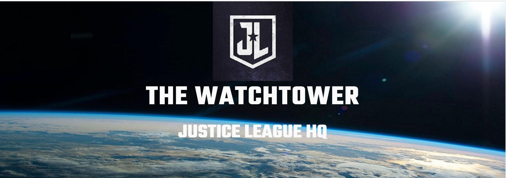

This is my submission for Milestone project 2. The Watchtower site is a fun interactive site based in the DC comic 
universe. It provides information on characters from the comic book franchise, using HTML5, CSS3 and JS to pull
through data based on the actions of the user.

Live project: [https://john-wallace89.github.io/JL-Watchtower/]

### User Experience (UX) ###

* User Story 1
As a customer, I can see what the site is for and the purpose of the site when I land on the page.

* User Story 2
As a customer the navigation around the site is clearly displayed.

* User Story 3
As a customer, I can clearly see the CTA to interact with 'Find the Heros' functionality.

* User Story 4
As a customer, when I click on a superhero icon, I can see that heros location on the map and
details about the hero. <h3 style="color: red">UPDATE</h3> change in functionality - reduced multiple buttons to single button,
providing desired information using one click rather than multiple.
* User Story 4(with change)
As a customer, when I click on the find a hero button, I can see that heros location on the map and
details about the hero.

* User Story 5
As an admin, it is clear that the site is for fun and is easy to navigate and interactive.

* User Story 6
As a customer when I click on a 'Select a new hero' button, i'm directed back to the original list
of heros.<h3 style="color: red">UPDATE</h3>User story now invalid due to change in functionality highlighted in User Story 4.

* User Story 7
As a customer, I can see a clear CTA to interact the 'Find Recruits' functionality.

* User Story 8
As a customer, when i click on one of the presented region, I am presented with a recruit location
and information on that recruit.<h3 style="color: red">UPDATE</h3>New functionality. Reason for change was to increase interactivity
and add multiple levels of interaction.
* User Story 8(with change)
As a customer, when I click on the recruit tile, the tile flips, and I can see that heros details and information
about the hero I can use elsewhere on the site.

* User Story 9
As a customer when I click on a 'Select a new city' button, i'm taken back to the original list of cities.
<h3 style="color: red">UPDATE</h3> User story invalid due to change made to User Story 8.

* User story 9 (with change)
As a customer, I can enter the secret identity of the hero in the previous section into the map and,
it will display the hero's location on the map.

* User Story 10
As a customer, I can see a clear CTA to interact the 'Find Villains' functionality

* User Story 11
As a customer, when i click on one of the map locator icons, I am presented with a 'crime' location
and information on that crime such as the villain behind it.
<h3 style="color: red">UPDATE</h3> Added link to pop-up to provide information on the villains committing the
crime.

* User Story 12 (NEW - Added functionality
As a customer, I can report a crime in the 'contact us' section. I receive a confirmation that my email has been
sent and an automatic reply.

### Design ###

* Colour scheme - The colour scheme is dark blue and white which matches with the imagery on the site
and helps towards a sleek, 'space-age' modern aesthetic.

* Typography - the 'Teko' font is used as it is bold, easy to read and suits the hero/comicbook feel and
aesthetic of the site.

* Imagery - The hero image is the logo for the Justice League. background imagery was chosen to convey a futuristic
aesthetic and a setting in space. Images were used to display the characters mentioned throughout the site.

* WireFrames:
Desktop and Mobile wireframes - https://marvelapp.com/prototype/9ihcaij

* Features:
Responsive layout on mobile and tablet. Interactive Maps, email and card-flip functionality.

### Technologies: ###

* Languages - 
HTML5
CSS3
JS

* Frameworks/libraries/programs - 
  https://favicon.io/favicon-converter/ - Used to create logo for title.

  https://www.rawpixel.com - Used for background image.

  https://fonts.google.com/ - used for font design.

  Bootstrap 4.3.1 - https://getbootstrap.com/docs/4.3/getting-started/introduction/ - used to help with responsiveness
  of the site, button functionality

  Free formatter - https://www.freeformatter.com/css-beautifier.html used to beautify CSS3 code

  https://blog.hubspot.com/website/css-fade-in for Fade in animation.

  Mapbox - https://docs.mapbox.com/

  

<h2 style="text-align: center">Testing</h2>

The W3C Markup Validator, W3C CSS and JSHint Validator Services were used to validate the project pages to ensure
there were no syntax errors.

* [W3C Markup validator](https://validator.w3.org/#validate_by_input)
No errors were returned from the HTML validator.

* [W3C CSS validator](https://jigsaw.w3.org/css-validator/validator)
No errors were returned from the CSS validator

* [JSHint](https://jshint.com/)
No errors or warnings shown

### Testing user stories ###
* User Story 1 & 5
As a customer, I can see what the site is for and the purpose of the site when I land on the page.
Result: 
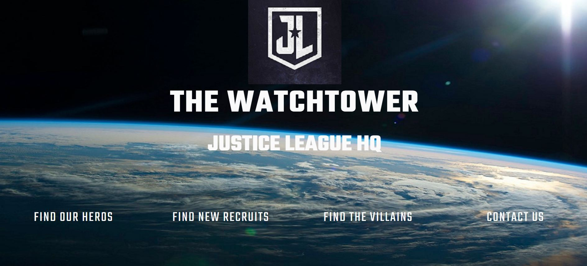
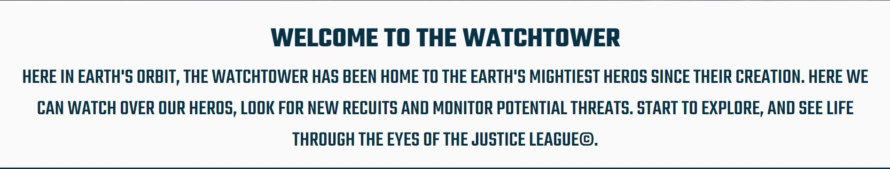
There is a clear page title followed by a clear navigation bar defining the different functionality on the site.
This is followed by an introductory statement providing a brief for the site and a prompt for the user to navigate
around the site.

* User Story 2 & 5
As a customer the navigation around the site is clearly displayed.
Result:

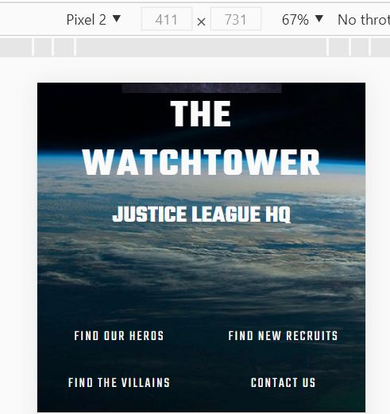
Navigation is clear across multiple screen sizes and is highlighted and changes to pointer cursor when user
hovers over it to show this is a clickable element. When a user clicks on one of the nav links, site uses smooth
scroll to navigate to each section and there is a scroll to top button so the customer can easily return to the
navigation menu.

* User Story 3
As a customer, I can clearly see the CTA to interact with 'Find the Heros' functionality.
Result:
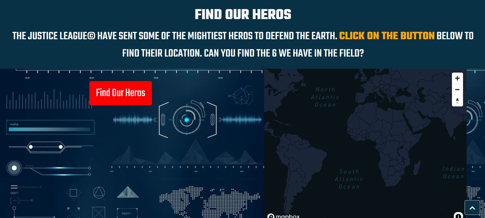
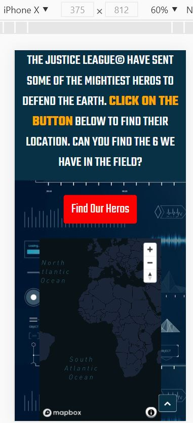
When I click on the 'Find the Heros' Nav link, i'm taken to the appropriate section. The user see's a CTA highlighted
in orange to draw the users attention. The actionable button is highlighted red with a description of 'Find Heros'
and is clear across various screen sizes.

* User Story 4(with change)
As a customer, when I click on the find a hero button, I can see that heros location on the map and
details about the hero.
Result:
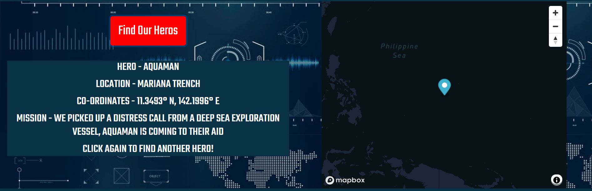
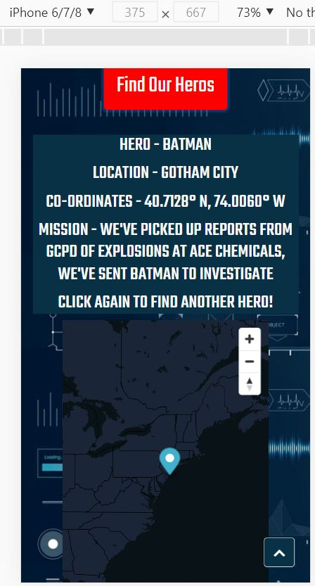
When the button is clicked on, a marker will appear on the map (with one exception) and an area will be populated
with details about the hero, their location and their mission. This is visible across multiple screen sizes. When
the user arrives at character 'martian-manhunter' the user is prompted with a new CTA which takes the user to a
different page, and the user can see an embedded link to the Mars rover footage, and the option to return to the
main page.
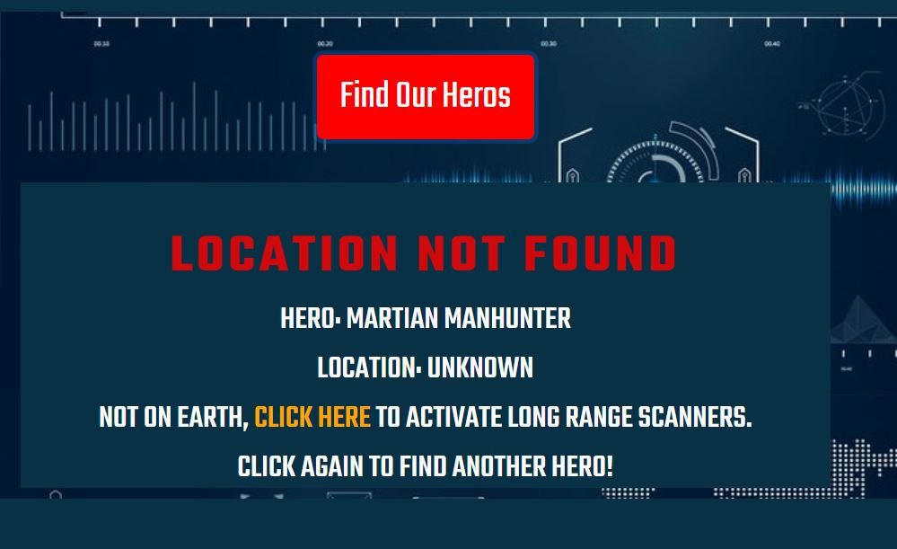
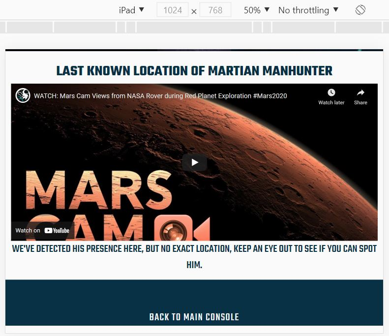

* User Story 7 & 8
As a customer, I can see a clear CTA to interact with the 'Find Recruits' functionality.
Result:
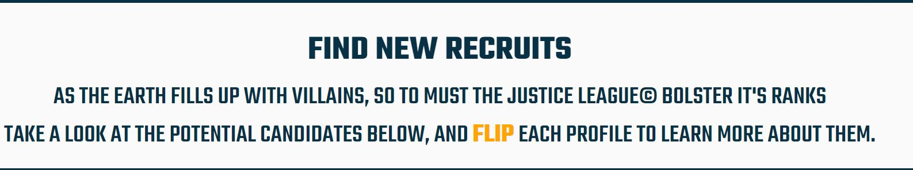
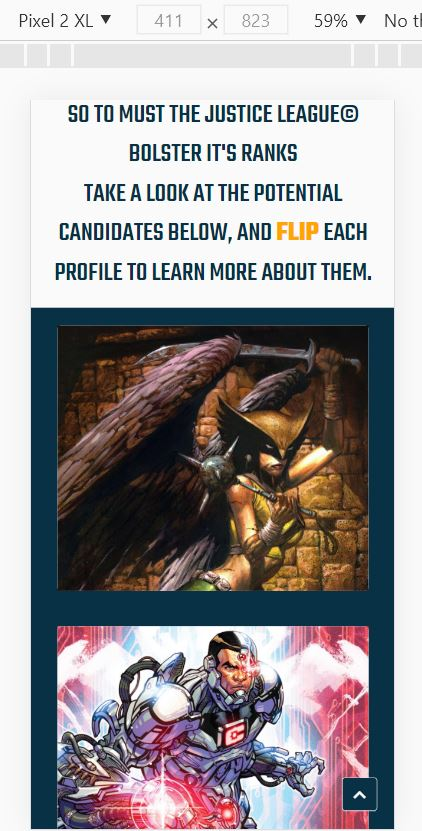
The 'Find New Recruits' section is clearly explained with the CTA highlighted in orange. When the user clicks on
one of the tiles, the tile flips and presents the user with some information. The layout of the tiles changes dependent on
the screen size for better UX.

* User story 9 (with change)
As a customer, I can enter the secret identity of the hero in the previous section into the map and,
it will display the hero's location on the map.
Result:
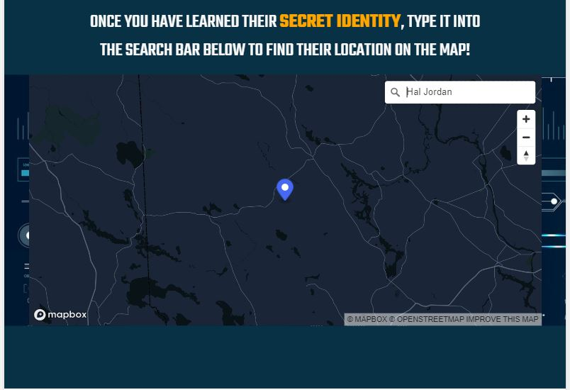
User can type in the secret identity of a hero into the search box, and once the option is selected the user will
be shown a marker with the hero's location. There is a clear CTA uner the tiles to prompt which actions the use
should take. The map is responsive and can be displayed across different screen sizes.

* User Story 10 & 11
As a customer, I can see a clear CTA to interact the 'Find Villains' functionality.
Result:
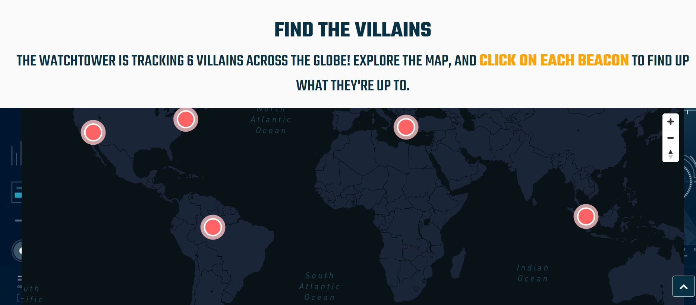
User is presented with a clear CTA highlighted in orange, that clearly describes the actions required from
the user. When the user clicks on a beacon, a pop-up is displayed with details about a 'crime' and a link to the
wikipedia page for details about the specific villain.
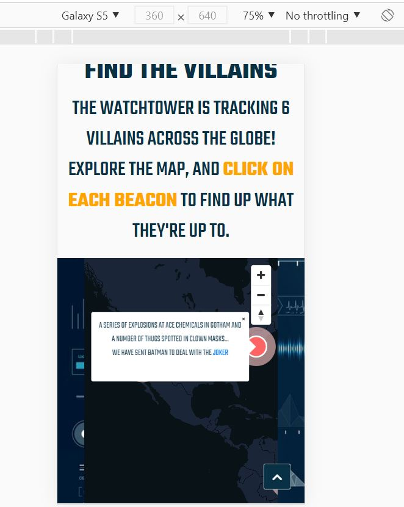
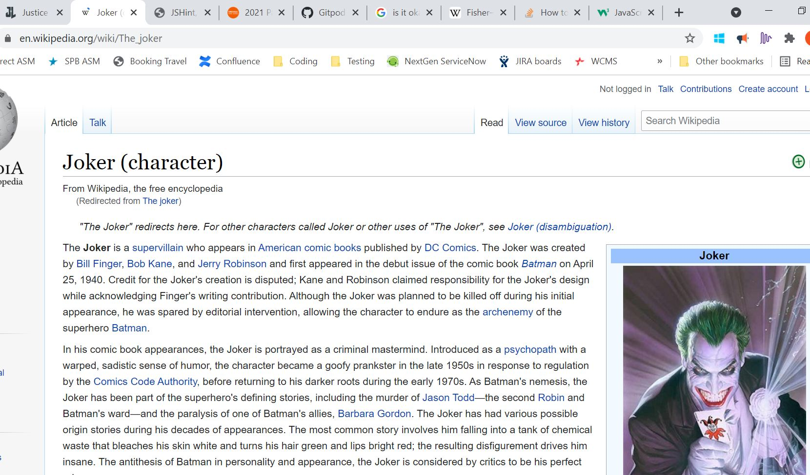
The map is responsive and the link opens in a new page.

* User Story 12 (NEW - Added functionality
As a customer, I can report a crime in the 'contact us' section. I receive a confirmation that my email has been
sent and an automatic reply.
Results:
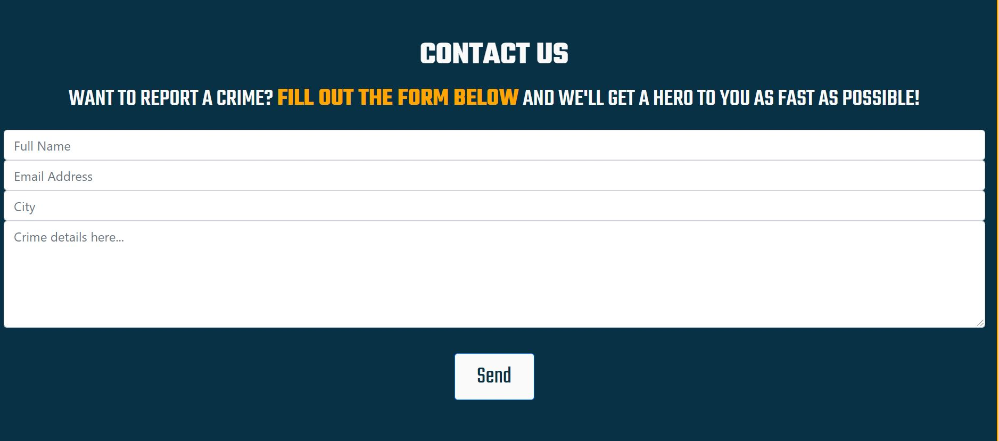
There is a clear CTA highlighted in orange. Placeholders have been left in each field to identify what information
is required. When the user clicks send, they are presented with an alert to say they have been successful in
submitting a form, and then receive an automatice reply with a response.
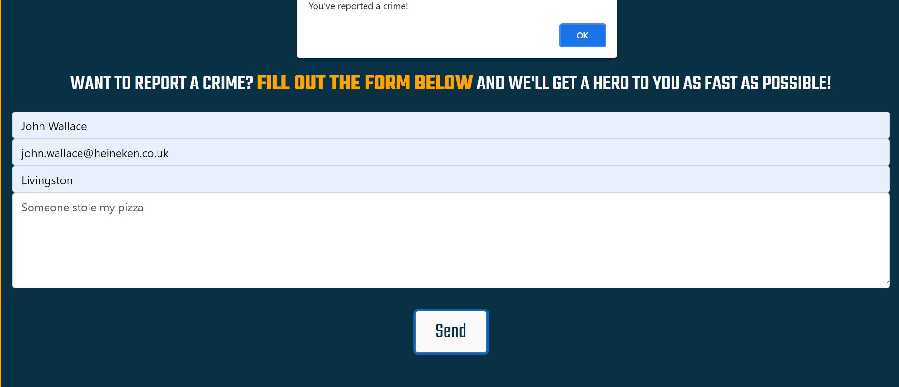
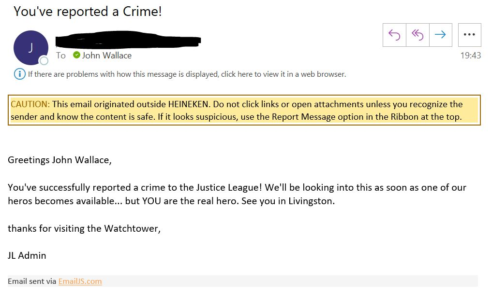

### Further testing ###
     

* Bugs:
     The navigation links do not render correctly on Iphone 5 screen:
     
     Resolved: No, Iphone 5 is now an old model and the navigation renders correctly on all Iphone models in
     the last 5 years. 
     Future fix may include a collapsable nav bar that lends itself to smaller screens.

* Changes from design:
Changes in design are detailed in the user story section above, key changes include:
User story 4 - change in functionality from multiple buttons to one button to reduce the clutter on the site.

User story 8 - Change from buttons to 'Flip' tiles to add nother dimension of interactivity to the site.

User story 9 - Included geocoder API in map and added custom data. This was to change the type of interaction with
the various maps on the site.

User story 11 - Enhanced functionality to provide link to external site and provide more information on 'villains'

User story 12 - Added functionality of contact form the email.js to increase interaction of the site.

* Potential enhancements:
The use of a collapsable nav bar (as detailed in the bugs section) would help with displaying navigation on
smaller screens.

The 'Find Our Heros' functionality sometimes repeats objects in the array, which lets down the UX of the site.
This means the user has to click several times to see the information for each hero. A potential fix for this would
be removing an object from the Array once it has been displayed, or, using the Fisher-Yates algorithm (suggested by
Code institute slack community Fisher-Yates ![https://en.wikipedia.org/wiki/Fisher%E2%80%93Yates_shuffle]) to prevent
repetition.

<h2 style="text-align: center">Deployment</h2>

### GitHub Pages ###
The project was deployed to GitHub Pages using the following steps...

#### Log in to GitHub and locate the GitHub Repository ####

* At the top of the repository section, locate the "Settings" Button on the menu.
* Scroll down the settings page until you find the "GitHub Pages" section.
* You will see a message "Pages settings now has its own dedicated tab! Check it out here!" click on the link.
* Under "Source", click the dropdown and select "Master Branch".The page will refresh.
* The now published site link in the "GitHub Pages" section will be found at the top of the page.

### Forking the GitHub Repository ###
By forking the GitHub Repository we make a copy of the original repository on our GitHub account to view and/or make changes without affecting the original repository by using the following steps...

#### Log in to GitHub and locate the GitHub Repository ####

* At the top of the repository section just above the "Settings" button on the menu, click the "Fork" button.
  The original repository in your GitHub account should now have duplicated.

#### Making a Local Clone ####

* Log in to GitHub and locate the GitHub repository, under the repository name, click "clone or download".
* To clone the repository using HTTPS, under "Clone with HTTPS", copy the link.
* Open Git Bash
* Change the current working directory to the location where you want the cloned directory to be made.
* Type git clone, and then paste the URL you copied in Step 2.
   * $ git clone https://github.com/YOUR-USERNAME/YOUR-REPOSITORY
* Press Enter. Your local clone will be created.
   * $ git clone https://github.com/YOUR-USERNAME/YOUR-REPOSITORY
> Cloning into `CI-Clone`...
> remote: Counting objects: 10, done.
> remote: Compressing objects: 100% (8/8), done.
> remove: Total 10 (delta 1), reused 10 (delta 1)
> Unpacking objects: 100% (10/10), done.

<h2 style="text-align: center">Credits</h2>

### Code ###
Bootstrap4: Bootstrap Library used throughout the project mainly to make site responsive using the Bootstrap Grid
System.

w3Schools.com to help with some of the syntax of the Js.

Mapbox.com for all the Map API's and Map/geocoder functionality.

Email.js for the contact us email functionality.

### Content ###

All typed content was written by the developer. All characters, and place names were provided by DC comics.

### Media ###

Live Mars rover footage [https://www.youtube.com/embed/6B_6K-splRU]
Credit - Youtube provided the video uploaded by channel Cosmosapiens.

#### Image credits ####

* Batman photo credit - Photo by <a href="https://unsplash.com/@lusik?utm_source=unsplash&utm_medium=referral&utm_content=creditCopyText">Marcin Lukasik</a> on <a href="https://unsplash.com/s/photos/batman?utm_source=unsplash&utm_medium=referral&utm_content=creditCopyText">Unsplash</a>
* Green Arrow Wallpaper - Image by <a href="https://wallpapercave.com/w/wp1973162">wallpapercave</a>
* Green Lantern Wallpaper - Image by <a href="https://wallpaperaccess.com/green-lantern">wallpaper access</a>
* Black Canary Wallpaper - Image by <a href="https://wallpapercave.com/w/wp1916634">wallpaper cave</a>
* Hawkgirl Wallpaper - image by <a href="https://wallpapercave.com/hawkgirl-wallpapers">wallpaper cave</a>
* Cyborg wallpaper - image by <a href="https://wallpapercave.com/w/wp6281826">wallpaper cave</a>
* Shazam wallpaper - image by <a href="https://wallpapercave.com/w/wp7325578">Wallpaper cave</a>

All books, titles, characters, character names, slogans, logos, and related indicia are trademarks of and copyright
DC Comics and/or WildStorm Productions, an imprint of DC Comics.

### Acknowledgements ###
Thanks to Aaron my mentor, for advice on my project and the Code Institute Slack community.